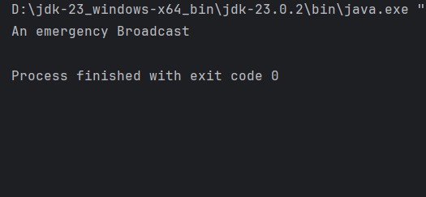
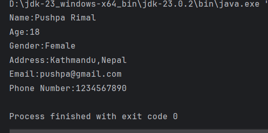
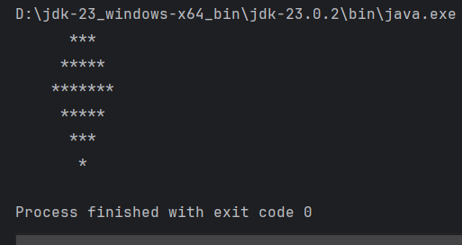

# 1 Getting Started

**to be committed by 10th February**

1 Hello World        ${\color{blue}-- completed}$\
2 Test               ${\color{green}-- completed}$\
3 Personal Details   ${\color{green}-- completed}$\
4 Diamonds           ${\color{green}--completed}$\
5 Questions          ${\color{green}-- completed}$

Please replace ${\color{green}-- todo}$ with ${\color{blue}-- completed}$ once done.

---

For each question in the exercise, please either display the output generated by running the program, or the answer if the task is a question.

1 -
public class HelloWorld {
public static void main(String[]args){
System.out.println("HelloWorld");
}
}

2 -
a)Java is case sensitive.The file name should match class name. (Shows error)
b)It will run without any issues but the output changes to "An emergency Broadcast"
c)compiling error on "an" it will take it as a variable name instead of string (shows error)
d) program won't run as because it needs exact signature (Shows error)
e)Systemout doesnot consist of bogus (shows error)
f)every statement in java must end with semicolon (shows error)
g) the compiler reaches the end of the file without finding brace (shows error)

3 -
public class PersonalDetails {
public static void main(String[] args) {
System.out.println("Name:Pushpa Rimal");
System.out.println("Age:18");
System.out.println("Gender:Female");
System.out.println("Address:Kathmandu,Nepal");
System.out.println("Email:pushpa@gmail.com");
System.out.println("Phone Number:1234567890");

    }
}

4 -
public class Diamonds {
public static void main(String[] args) {
int trows =7;
int m = trows/2;

        for(int i=1;i<=m;i++){
            int space = trows-i;
            int stars = 2*i+1;

            for(int j=0;j<space;j++){
                System.out.print(" ");
            }
            for(int j=0;j<stars;j++){
                System.out.print("*");
            }
            System.out.println();
        }
        for(int i=m-1;i>=0;i--){
            int space = trows-i;
            int stars = 2*i+1;
            for(int j=0;j<space;j++){
                System.out.print(" ");
            }
            for(int j=0;j<stars;j++){
                System.out.print("*");
            }
            System.out.println();
        }

    }
}

5 -
a)The latest version is Java SE 21.
b)Java SE is used for general purpose applications and Java ME is designed for resourse constrained devices.
c)Java is available on all major operating systems.
d)IntelliJ IDEA is most popular IDE available for Java apart from Eclipse.
e)The main()function serves as the entry point for a Java application.

