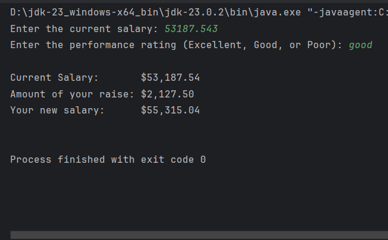
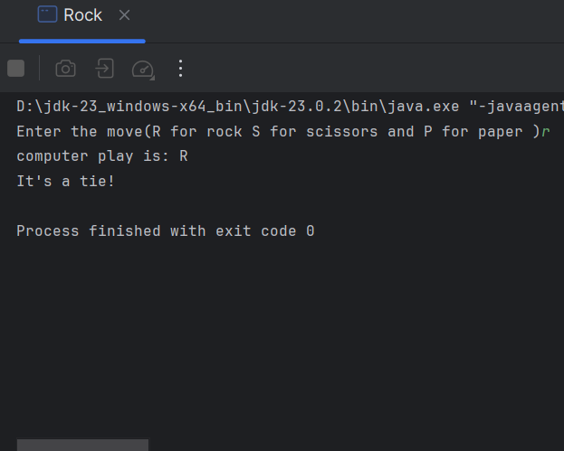
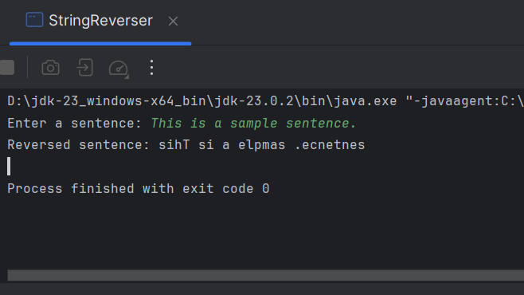

# 3 Data And Expressions

**to be committed by 24th February**

1 Computing A Pay Increase   ${\color{green}-- completed}$\
2 Rock, Paper, Scissors               ${\color{green}-- completed}$\
3 String Reverser   ${\color{green}-- completed}$\
4 Punctuation Marks  ${\color{green}-- completed}$

Please replace ${\color{green}-- todo}$ with ${\color{blue}-- completed}$ once done.

---

For each question in the exercise, please either display the output generated by running the program, or the answer if the task is a question.

1 -
// ***************************************************************
//   Salary.java
//
//   Computes the amount of a raise and the new
//   salary for an employee.  The current salary
//   and a performance rating (a String: "Excellent",
//   "Good" or "Poor") are input.
// ***************************************************************

import java.util.Scanner;
import java.text.NumberFormat;

public class Salary
{
public static void main (String[] args)
{
double currentSalary;  // employee's current  salary
double raise;          // amount of the raise
double newSalary;      // new salary for the employee
String rating;         // performance rating

        Scanner scan = new Scanner(System.in);

        System.out.print ("Enter the current salary: ");
        currentSalary = scan.nextDouble();
        System.out.print ("Enter the performance rating (Excellent, Good, or Poor): ");
        rating = scan.next();

        // Compute the raise using if ...
        if (rating.equalsIgnoreCase("Excellent")) {
            raise = currentSalary * 0.06;
        } else if (rating.equalsIgnoreCase("Good")) {
            raise = currentSalary * 0.04;
        } else if (rating.equalsIgnoreCase("Poor")) {
            raise = currentSalary * 0.015;
        } else {
            System.out.println("Invalid rating. No raise applied.");
            raise = 0;
        }

        newSalary = currentSalary + raise;

        // Print the results
        NumberFormat money = NumberFormat.getCurrencyInstance();
        System.out.println();
        System.out.println("Current Salary:       " + money.format(currentSalary));
        System.out.println("Amount of your raise: " + money.format(raise));
        System.out.println("Your new salary:      " + money.format(newSalary));
        System.out.println();
    }
}

---

2 -
// ****************************************************************
//   Rock.java
//
//   Play Rock, Paper, Scissors with the user
//
// ****************************************************************
import javax.swing.*;
import java.util.Scanner;
import java.util.Random;

public class Rock
{
public static void main(String[] args) {
String personPlay;    //User's play -- "R", "P", or "S"
String computerPlay="";  //Computer's play -- "R", "P", or "S"
int computerInt;      //Randomly generated number used to determine
//computer's play

        Scanner scan = new Scanner(System.in);
        Random generator = new Random();

        //Get player's play -- note that this is stored as a string
        System.out.print("Enter the move(R for rock S for scissors and P for paper )");
        //Make player's play uppercase for ease of comparison
        personPlay = scan.nextLine().toUpperCase();

        //Generate computer's play (0,1,2)
        computerInt = generator.nextInt(3);
        //Translate computer's randomly generated play to string
        switch(computerInt) {

            case 0:
                computerPlay = "R";
                break;
            case 1:
                computerPlay = "S";
                break;
            case 2:
                computerPlay = "P";
                break;
        }

        //Print computer's play
        System.out.println("computer play is: " + computerPlay);

        //See who won.  Use nested ifs instead of &&.
        if (personPlay.equals(computerPlay))
            System.out.println("It's a tie!");
        else if (personPlay.equals("R"))
            if (computerPlay.equals("S"))
                System.out.println("Rock crushes scissors.  You win!!");
            else
                System.out.println("paper covers rocks.  You lose!");
        else if (personPlay.equals("P"))
            if(computerPlay.equals("R"))
                System.out.println("paper covers rock.  You win!!");
            else
                System.out.println("scissors cut paper.  You lose!");
        else if (personPlay.equals("S"))
            if (computerPlay.equals("P"))
                    System.out.println("scissors cut papers.  You win!!");
            else
                System.out.println("rock crushes scissors.  You lose!");

        scan.close();

    }
}

---

3 -
---
import java.util.Scanner;

public class StringReverser {
public static void main(String[] args) {
Scanner scan = new Scanner(System.in);

        //  input
        System.out.print("Enter a sentence: ");
        String sentence = scan.nextLine();
        String[] words = sentence.split(" ");
        StringBuilder reversedSentence = new StringBuilder();

        // Reverse 
        for (String word : words) {
            StringBuilder reversedWord = new StringBuilder(word);
            reversedSentence.append(reversedWord.reverse()).append(" ");
        }

        //  result
        System.out.println("Reversed sentence: " + reversedSentence.toString().trim());

        scan.close();
    }
}

---

4 -

---
public class punctuationMarks {
public static void main(String[] args) {
// from qns
String text = "Mary had a little lamb, her fleece was as white as snow, and everywhere Mary went, the lamb was sure to go.\n-that was a nice poem-\nthe end.";

        // Array of punctuation marks to track
        char[] punctuationMarks = {',', '.', '-', '\n'};
        int[] count = new int[punctuationMarks.length]; // Array to store counts

        // Count occurrences of each punctuation mark
        for (char ch : text.toCharArray()) {
            for (int i = 0; i < punctuationMarks.length; i++) {
                if (ch == punctuationMarks[i]) {
                    count[i]++;
                }
            }
        }

        // Display the table
        System.out.println("Punctuation Mark | Count");
        System.out.println("-----------------|------");
        for (int i = 0; i < punctuationMarks.length; i++) {
            System.out.printf("        %c        |   %d%n", punctuationMarks[i], count[i]);
        }
    }
}

