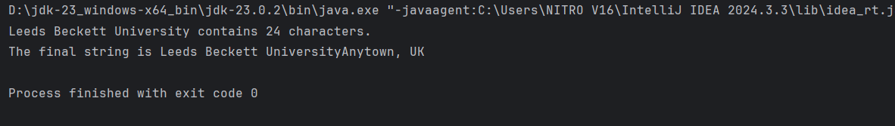
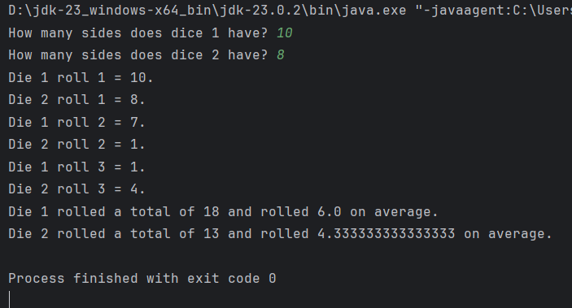
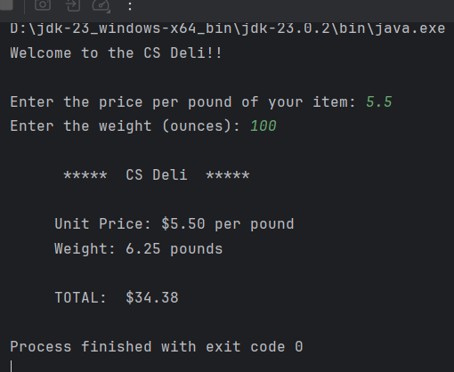
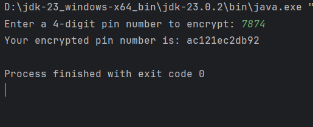
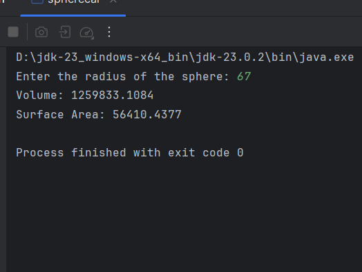

# 3 Classes And Objects

**to be committed by 3rd March**

1 Using String Objects   ${\color{green}-- completed}$\
2 Dice               ${\color{green}-- completed}$\
3 Formatting Output   ${\color{green}-- completed}$\
4 Pin Encryption  ${\color{green}-- completed}$\
5 Sphere Calculations ${\color{green}-- completed}$

Please replace ${\color{green}-- todo}$ with ${\color{blue}-- completed}$ once done.

---

For each question in the exercise, please either display the output generated by running the program, or the answer if the task is a question.

1 -

---
// **************************************************
//   StringPlay.java
//
//   Play with String objects
// **************************************************

public class StringPlay {
public static void main(String[] args) {
String college = new String ("Leeds Beckett University"); // Similar  part (a)

        String town = new String("Anytown, UK"); // part (a)

        int stringLength;
        String change1, change2, change3;

        stringLength = college.length(); // part (b)

        System.out.println (college + " contains " + stringLength + " characters.");

        change1 = college.toUpperCase(); // part (c)

        change2 = change1.replace('E', '*'); // part (d)

        change3 = college.concat(town); // part (e)

        System.out.println ("The final string is " + change3);
    }
}

---
2 -

---
import java.util.Scanner;
import java.util.Random;

public class DiceRoll {
public static void main(String[] args) {
Scanner scanner = new Scanner(System.in);
Random rand = new Random();

        // Prompt user for the number of sides for each dice
        System.out.print("How many sides does dice 1 have? ");
        int sidesDie1 = scanner.nextInt();

        System.out.print("How many sides does dice 2 have? ");
        int sidesDice2 = scanner.nextInt();

        int sumDice1 = 0, sumDice2 = 0;

        // Roll the dice three times
        for (int i = 1; i <= 3; i++) {
            int rollDice1 = rand.nextInt(sidesDie1) + 1; // Generate number between 1 and sidesDice1
            int rollDice2 = rand.nextInt(sidesDice2) + 1; // Generate number between 1 and sidesDice2

            sumDice1 += rollDice1;
            sumDice2 += rollDice2;

            System.out.println("Die 1 roll " + i + " = " + rollDice1 + ".");
            System.out.println("Die 2 roll " + i + " = " + rollDice2 + ".");
        }

        // Calculate and display total and average
        double avgDice1 = sumDice1 / 3.0;
        double avgDice2 = sumDice2 / 3.0;

        System.out.println("Die 1 rolled a total of " + sumDice1 + " and rolled " + avgDice1 + " on average.");
        System.out.println("Die 2 rolled a total of " + sumDice2 + " and rolled " + avgDice2 + " on average.");

        scanner.close();
    }
}

---
3 -
---
// ********************************************************
// DeliFormat.java
//
// Computes the price of a deli item given the weight
// (in ounces) and price per pound -- prints a label,
// nicely formatted, for the item.
//
// ********************************************************

import java.util.Scanner;
import java.text.DecimalFormat;
import java.text.NumberFormat;

public class Deli
{
// ---------------------------------------------------
//  main reads in the price per pound of a deli item
//  and number of ounces of a deli item then computes
//  the total price and prints a "label" for the item
// ---------------------------------------------------
public static void main (String[] args)
{
final double OUNCES_PER_POUND = 16.0;

        double pricePerPound;    // price per pound
        double weightOunces;  // weight in ounces
        double weight;              // weight in pounds
        double totalPrice;         // total price for the item

        Scanner scan = new Scanner(System.in);

        // Declare money as a NumberFormat object and use the
        // getCurrencyInstance method to assign it a value
        NumberFormat money = NumberFormat.getCurrencyInstance();

        // Declare fmt as a DecimalFormat object and instantiate
        // it to format numbers with at least one digit to the left of the
        // decimal and the fractional part rounded to two digits.
        DecimalFormat fmt = new DecimalFormat("0.00");

        // prompt the user and read in each input
        System.out.println ("Welcome to the CS Deli!!\n ");

        System.out.print ("Enter the price per pound of your item: ");
        pricePerPound = scan.nextDouble();

        System.out.print ("Enter the weight (ounces): ");
        weightOunces = scan.nextDouble();

        // Convert ounces to pounds and compute the total price
        weight = weightOunces / OUNCES_PER_POUND;
        totalPrice = pricePerPound * weight;

        // Print the label using the formatting objects
        // fmt for the weight in pounds and money for the prices
        System.out.println("\n      *****  CS Deli  *****\n");
        System.out.println("     Unit Price: " + money.format(pricePerPound) + " per pound");
        System.out.println("     Weight: " + fmt.format(weight) + " pounds");
        System.out.println("\n     TOTAL:  " + money.format(totalPrice));

        scan.close();
    }
}

---

4 -
---
import java.util.Random;
import java.util.Scanner;

public class encrypin {
public static void main(String[] args) {
Scanner sc = new Scanner(System.in);
Random rand = new Random();

        // Get pi from the user
        System.out.print("Enter a 4-digit pin number to encrypt: ");
        String pinHex = Integer.toHexString(sc.nextInt()); // Convert PIN to Hex

        // Generate n convert to  hex
        String randomHex1 = Integer.toHexString(rand.nextInt(64536) + 1000);
        String randomHex2 = Integer.toHexString(rand.nextInt(64536) + 1000);

        // Concatenate the hex values
        String encryptedPin = randomHex1 + pinHex + randomHex2;

        // Output
        System.out.println("Your encrypted pin number is: " + encryptedPin);

    }
}

---

5 -
---
import java.util.Scanner;

public class spherecal {
public static void main(String[] args) {
Scanner sc = new Scanner(System.in);
System.out.print("Enter the radius of the sphere: ");
double radius = sc.nextDouble();

        double volume = (4.0 / 3.0) * Math.PI * Math.pow(radius, 3);

        double surfaceArea = 4 * Math.PI * Math.pow(radius, 2);

        //  rounded to four decimal places
        System.out.printf("Volume: %.4f%n", volume);
        System.out.printf("Surface Area: %.4f%n", surfaceArea);
    }
}

