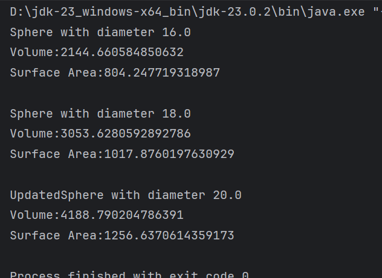
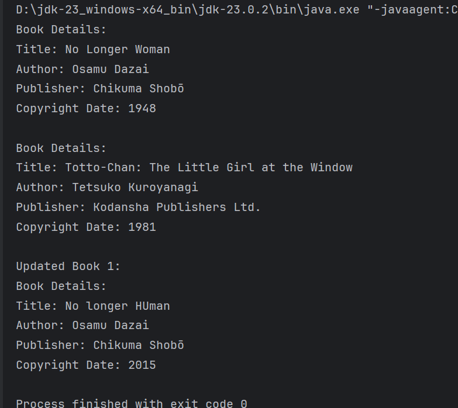
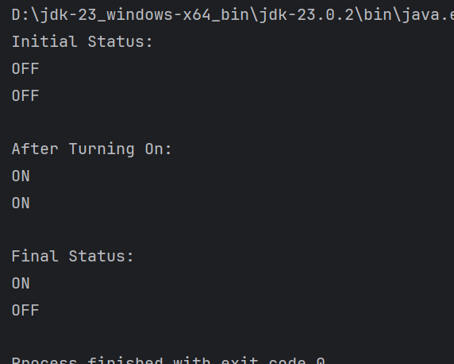
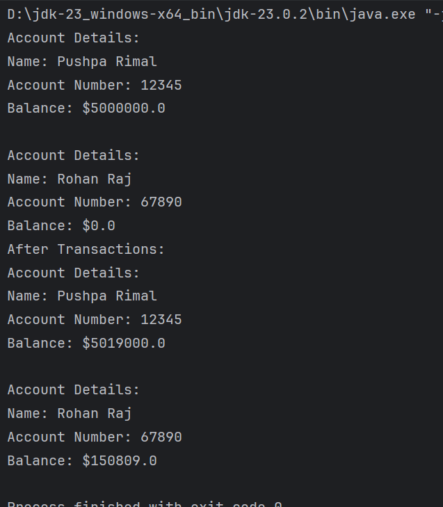
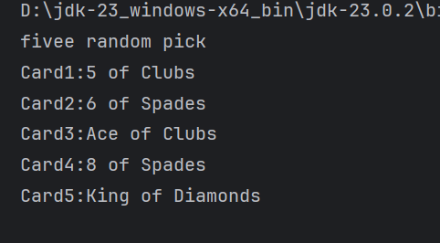

# 5&6 Writing Classes And Methods (two week's worth)

**to be committed by 17th March (extra week given and more work)**

1 Sphere   ${\color{green}-- completed}$\
2 Books               ${\color{green}-- completed}$\
3 Bulb   ${\color{green}-- completed}$\
4 Account  ${\color{green}-- completed}$\
5 Cards ${\color{green}-- completed}$

Please replace ${\color{green}-- todo}$ with ${\color{blue}-- completed}$ once done.

---

For each question in the exercise, please either display the output generated by running the program, or the answer if the task is a question.

1 -
---
public class Sphere {
private double diameter;
public Sphere(double diameter) {
this.diameter = diameter;
}
public double getDiameter() {//getter
return diameter;
}
public void setDiameter(double diameter) {//setter
this.diameter = diameter;
}

    public double calculateVolume() {
        double radius = diameter / 2.0;
        return (4.0 / 3.0) * Math.PI * Math.pow(radius, 3);
    }

    public double calculateSurfaceArea() {
        double radius = diameter / 2.0;
        return 4.0 * Math.PI * Math.pow(radius, 2);
    }
    @Override
    public String toString() {
        return "Sphere with diameter "+ diameter;
    }
}
---
public class MultiSphere {
public static void main(String[] args) {

        Sphere sphere1 = new Sphere(16.0);
        Sphere sphere2 = new Sphere(18.0);

        System.out.println(sphere1.toString());
        System.out.println("Volume:"+ sphere1.calculateVolume());
        System.out.println("Surface Area:"+ sphere1.calculateSurfaceArea());

        System.out.println();

        System.out.println(sphere2.toString());
        System.out.println("Volume:"+ sphere2.calculateVolume());
        System.out.println("Surface Area:"+ sphere2.calculateSurfaceArea());

        sphere1.setDiameter(20.0);// Update
        System.out.println("\nUpdated"+ sphere1.toString());
        System.out.println("Volume:"+ sphere1.calculateVolume());
        System.out.println("Surface Area:"+ sphere1.calculateSurfaceArea());
    }
}
---

2 -
public class Book {
private String title;
private String author;
private String publisher;
private int copyrightDate;

    public Book(String title, String author, String publisher, int copyrightDate) {  // Constructor
        this.title = title;
        this.author = author;
        this.publisher = publisher;
        this.copyrightDate = copyrightDate;
    }

    // Getter and setter for title
    public String getTitle() {
        return title;
    }
    public void setTitle(String title) {
        this.title = title;
    }

    public String getAuthor() {
        return author;
    }
    public void setAuthor(String author) {
        this.author = author;
    }

    public String getPublisher() {
        return publisher;
    }
    public void setPublisher(String publisher) {
        this.publisher = publisher;
    }

    public int getCopyrightDate() {
        return copyrightDate;
    }
    public void setCopyrightDate(int copyrightDate) {
        this.copyrightDate = copyrightDate;
    }

    @Override
    public String toString() {
        return "Book Details:\n" +
                "Title: " + title + "\n" +
                "Author: " + author + "\n" +
                "Publisher: " + publisher + "\n" +
                "Copyright Date: " + copyrightDate;
    }
}
public class BookShelf {
public static void main(String[] args) {
Book book1 = new Book("No Longer Woman", "Osamu Dazai", "Chikuma Shobō", 1948);
Book book2 = new Book("Totto-Chan: The Little Girl at the Window", "Tetsuko Kuroyanagi", "Kodansha Publishers Ltd.", 1981);

        System.out.println(book1.toString());
        System.out.println();
        System.out.println(book2.toString());

        book1.setTitle("No longer HUman");
        book1.setCopyrightDate(2015);

        System.out.println("\nUpdated Book 1:");
        System.out.println(book1.toString());
    }
}
---

3 -
public class Bulb {
private boolean isOn;

    // Constructor: Initializes the bulb to be off
    public Bulb() {
        isOn = false;
    }
    public void turnOn() {
        isOn = true;
    }
    public void turnOff() {
        isOn = false;
    }
    public String checkStatus() {
        return isOn ? "ON" : "OFF";
    }
}
public class Lights {
public static void main(String[] args) {
Bulb bulb1 = new Bulb();
Bulb bulb2 = new Bulb();
System.out.println("Initial Status:");
System.out.println(bulb1.checkStatus());
System.out.println(bulb2.checkStatus());

        bulb1.turnOn();
        bulb2.turnOn();

        System.out.println("\nAfter Turning On:");
        System.out.println(bulb1.checkStatus());
        System.out.println(bulb2.checkStatus());

        bulb2.turnOff();

        System.out.println("\nFinal Status:");
        System.out.println(bulb1.checkStatus());
        System.out.println(bulb2.checkStatus());
    }
}

---

4 -
public class Account {
private String name;
private int accountNumber;
private double balance;

    // Constructor to initialize name, account number, and balance
    public Account(String name, int accountNumber, double balance) {
        this.name = name;
        this.accountNumber = accountNumber;
        this.balance = balance;
    }

    // Constructor for name and account number (initial balance = 0)
    public Account(String name, int accountNumber) {
        this.name = name;
        this.accountNumber = accountNumber;
        this.balance = 0.0;
    }

    // Getter for name
    public String getName() {
        return name;
    }

    // Getter for account number
    public int getAccountNumber() {
        return accountNumber;
    }

    // Getter for balance
    public double getBalance() {
        return balance;
    }

    // Method to deposit money
    public void deposit(double amount) {
        if (amount > 0) {
            balance += amount;
        }
    }

    // Method to withdraw money
    public void withdraw(double amount) {
        if (amount > 0 && amount <= balance) {
            balance -= amount;
        }
    }

    // toString method to display account information
    @Override
    public String toString() {
        return "Account Details:\n" +
                "Name: " + name + "\n" +
                "Account Number: " + accountNumber + "\n" +
                "Balance: $" + balance;
    }
}
public class Transactions {
public static void main(String[] args) {
Account account1 = new Account("Pushpa Rimal", 12345, 5000000.0);
Account account2 = new Account("Rohan Raj", 67890);
System.out.println(account1.toString());
System.out.println();
System.out.println(account2.toString());
account1.deposit(20000.0);
account1.withdraw(1000.0);

        account2.deposit(150809.0);

        System.out.println("After Transactions:");
        System.out.println(account1.toString());
        System.out.println();
        System.out.println(account2.toString());
    }
}

---

5 -
import java.util.Random;

public class Card {
private String suit;
private String faceValue;
private static final String[] SUITS = {"Hearts", "Diamonds", "Clubs", "Spades"};
private static final String[] FACE_VALUES = {
"2", "3", "4", "5", "6", "7", "8", "9", "10",
"Jack", "Queen", "King", "Ace"
};

    public Card(String suit, String faceValue) { // Constructor
        this.suit = suit;
        this.faceValue = faceValue;
    }

    public String getSuit() {
        return suit;
    }

    public String getFaceValue() {
        return faceValue;
    }
    public void setSuit(String suit) {
        this.suit = suit;
    }

    public void setFaceValue(String faceValue) {
        this.faceValue = faceValue;
    }
    public String toString() {
        return faceValue + " of " + suit;
    }
    public static Card getRandomCard() {
        Random rand = new Random();
        String randomSuit = SUITS[rand.nextInt(SUITS.length)];
        String randomFaceValue = FACE_VALUES[rand.nextInt(FACE_VALUES.length)];
        return new Card(randomSuit, randomFaceValue);
    }
}
public class DealCards {
public static void main(String[] args) {
System.out.println("fivee random pick ");

        for (int i = 0; i < 5;i++) {
            Card card = Card.getRandomCard();
            System.out.println("Card" + (i+1) + ":" + card);
        }
    }
}

---
