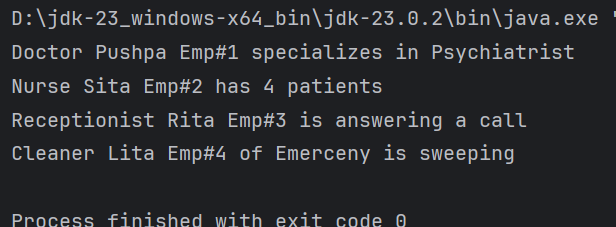
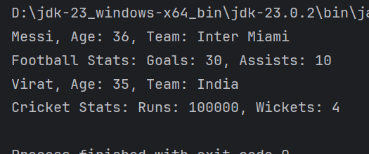

# 7 Inheritance

**to be committed by 24th March**

1 Hospital   ${\color{green}-- completed}$\
2 Player Statistics               ${\color{green}-- completed}$

Please replace ${\color{green}-- todo}$ with ${\color{blue}-- completed}$ once done.

---

For each question in the exercise, please either display the output generated by running the program, or the answer if the task is a question.

1 -
public class Hospital {

     
     static class Doctor {
         String name;
         int empId;
         String specialization;

         public Doctor(String name, int empId, String specialization) {
             this.name = name;
             this.empId = empId;
             this.specialization = specialization;
         }

         public void showSpecialization() {
             System.out.println("Doctor " + name + " Emp#" + empId + " specializes in " + specialization);
         }
     }

     
     static class Nurse {
         String name;
         int empId;
         int numberOfPatients;

         public Nurse(String name, int empId, int numberOfPatients) {
             this.name = name;
             this.empId = empId;
             this.numberOfPatients = numberOfPatients;
         }

         public void showPatients() {
             System.out.println("Nurse " + name + " Emp#" + empId + " has " + numberOfPatients + " patients");
         }
     }

     
     static class Receptionist {
         String name;
         int empId;

         public Receptionist(String name, int empId) {
             this.name = name;
             this.empId = empId;
         }

         public void answerCall() {
             System.out.println("Receptionist " + name + " Emp#" + empId + " is answering a call");
         }
     }

     
     static  class Cleaner {
         String name;
         int empId;
         String department;

         public Cleaner(String name, int empId, String department) {
             this.name = name;
             this.empId = empId;
             this.department = department;
         }

         public void sweep() {
             System.out.println("Cleaner " + name + " Emp#" + empId + " of " + department + " is sweeping");
         }
     }

public static void main(String[] args) {
Doctor doc = new Doctor("Pushpa", 1, "Psychiatrist");
Nurse nurse = new Nurse("Sita", 2, 4);
Receptionist receptionist = new Receptionist("Rita", 3);
Cleaner cleaner = new Cleaner("Lita", 4, "Emerceny");

             doc.showSpecialization();
             nurse.showPatients();
             receptionist.answerCall();
             cleaner.sweep();
         }
     }

---

2 -
public class PlayerStats {
class Player {
String name;
int age;
String team;
Player(String name, int age, String team) {
this.name = name;
this.age = age;
this.team = team;
}
void displayInfo() {
System.out.println(name + ", Age: " + age + ", Team: " + team);
}
}

    
    class FootballStats extends Player {
        int goals;
        int assists;
        FootballStats(String name, int age, String team, int goals, int assists) {
            super(name, age, team);
            this.goals = goals;
            this.assists = assists;
        }
        void showFootballStats() {
            displayInfo();
            System.out.println("Football Stats: Goals: " + goals + ", Assists: " + assists);
        }
    }

    
    class CricketStats extends Player {
        int runs;
        int wickets;
        CricketStats(String name, int age, String team, int runs, int wickets) {
            super(name, age, team);
            this.runs = runs;
            this.wickets = wickets;
        }
        void showCricketStats() {
            displayInfo();
            System.out.println("Cricket Stats: Runs: " + runs + ", Wickets: " + wickets);
        }
    }

    public static void main(String[] args) {
        PlayerStats app = new PlayerStats();

        FootballStats footballPlayer = app.new FootballStats("Messi", 36, "Inter Miami", 30, 10);
        CricketStats cricketPlayer = app.new CricketStats("Virat", 35, "India", 100000, 4);

        footballPlayer.showFootballStats();
        cricketPlayer.showCricketStats();
    }
}

---

