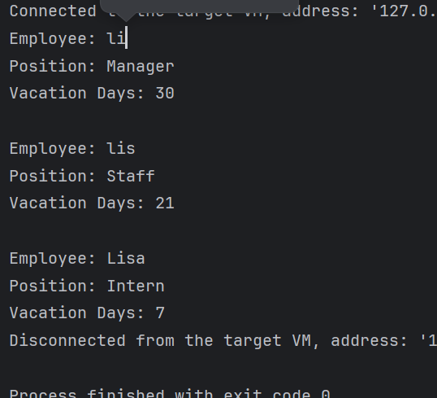
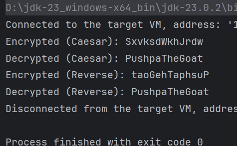

# 8 Polymorphism

**to be committed by 31st March**

1 Firm Vacation   ${\color{green}-- completed}$\
2 Firm Vacation               ${\color{green}-- completed}$

Please replace ${\color{green}-- todo}$ with ${\color{blue}-- completed}$ once done.

---

For each question in the exercise, please either display the output generated by running the program, or the answer if the task is a question.

1 -
public class FirmVacation {
class Employee {
String name;
String position;
Employee(String name, String position) {
this.name = name;
this.position = position;
}
void displayInfo() {
System.out.println("Employee: " + name+ "\nPosition: " + position);
}
int vacationDays() {
return 14;
}
}
class Manager extends Employee {
Manager(String name) {
super(name, "Manager");
}
@Override
int vacationDays() {
return 30;
}
}
class Staff extends Employee {
Staff(String name) {
super(name, "Staff");
}
@Override
int vacationDays() {
return 21;
}
}
class Intern extends Employee {
Intern(String name) {
super(name, "Intern");
}
@Override
int vacationDays() {
return 7;
}
}
public static void main(String[] args) {
FirmVacation firm = new FirmVacation();
Employee e1=firm.new Manager("li");
Employee e2=firm.new Staff("lis");
Employee e3=firm.new Intern("Lisa");

        e1.displayInfo();
        System.out.println("Vacation Days: " + e1.vacationDays() + "\n");
        e2.displayInfo();
        System.out.println("Vacation Days: " + e2.vacationDays() + "\n");
        e3.displayInfo();
        System.out.println("Vacation Days: " + e3.vacationDays());
    }
}

---

2 -
public class FirmVacationpp4 {
public interface Encryptable {
void encrypt();
String decrypt();
}
class Secret implements Encryptable {
private String message;
private String encrypted = "";
Secret(String message) {
this.message = message;
}
@Override
public void encrypt() {
StringBuilder sb = new StringBuilder();
for (char ch : message.toCharArray()) {
sb.append((char) (ch + 3)); // Caesar shift
}
encrypted = sb.toString();
System.out.println("Encrypted (Caesar): " + encrypted);
}
@Override
public String decrypt() {
StringBuilder sb = new StringBuilder();
for (char ch : encrypted.toCharArray()) {
sb.append((char) (ch - 3));
}
return sb.toString();
}
}

    class Password implements Encryptable {
        private String message;
        private String encrypted = "";
        Password(String message) {
            this.message = message;
        }
        @Override
        public void encrypt() {
            encrypted = new StringBuilder(message).reverse().toString();
            System.out.println("Encrypted (Reverse): " + encrypted);
        }
        @Override
        public String decrypt() {
            return new StringBuilder(encrypted).reverse().toString();
        }
    }

    public static void main(String[] args) {
        FirmVacationpp4 obj = new FirmVacationpp4();

        Encryptable secret = obj.new Secret("PushpaTheGoat");
        secret.encrypt();
        System.out.println("Decrypted (Caesar): " + secret.decrypt());

        Encryptable password = obj.new Password("PushpaTheGoat");
        password.encrypt();
        System.out.println("Decrypted (Reverse): " + password.decrypt());
    }
}

---
