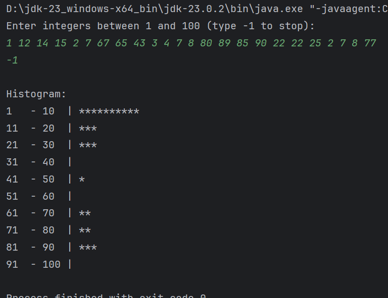
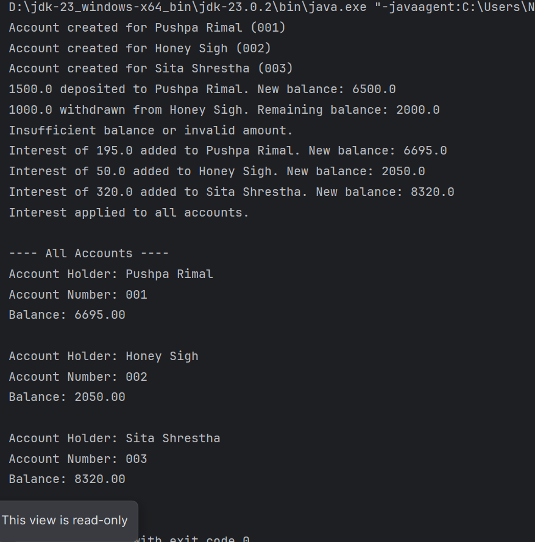
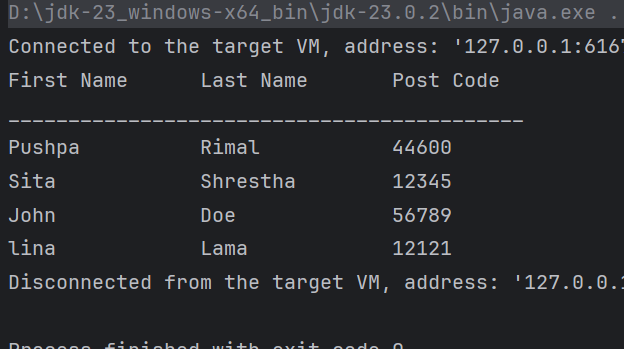
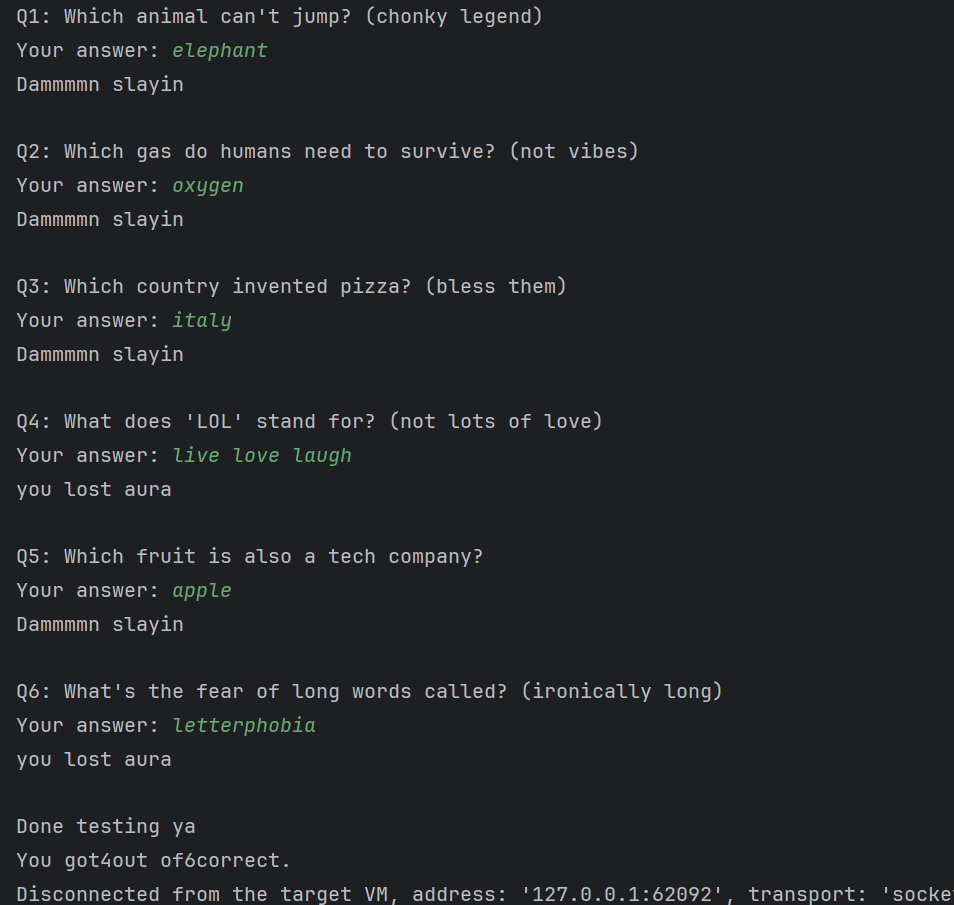

# 9 Further Arrays

**to be committed by 7th April`**

1 Histogram   ${\color{green}-- completed}$\
2 LL Bank Accounts               ${\color{green}-- completed}$\
3 Post Codes   ${\color{green}-- completed}$\
4 Quiz Time  ${\color{green}-- completed}$

Please replace ${\color{green}-- todo}$ with ${\color{blue}-- completed}$ once done.

---

For each question in the exercise, please either display the output generated by running the program, or the answer if the task is a question.

1 -

---
import java.util.Scanner;
public class Histogram {
public static void main(String[] args) {
Scanner scanner = new Scanner(System.in);
int[] bins = new int[10]; // 10 ranges (1–10, 11–20, ..., 91–100)
System.out.println("Enter integers between 1 and 100 (type -1 to stop):");
while (true) {
int num = scanner.nextInt();
if (num == -1) break;
if (num >= 1 && num <= 100) {
int index = (num - 1) / 10;
bins[index]++;
} else {
System.out.println("enter between 1 to 100");
}
}
System.out.println("Histogram:");
for (int i = 0; i < bins.length; i++) {
int rangeStart = i * 10 + 1;
int rangeEnd = (i + 1) * 10;
System.out.printf("%-3d - %-3d : ", rangeStart, rangeEnd);
for (int j = 0; j < bins[i]; j++) {
System.out.print("*");
}
System.out.println();
}
scanner.close();
}
}

---

2 -
class BankAccount {
protected String accountHolder;
protected String accountNumber;
protected double balance;
public BankAccount(String accountHolder, String accountNumber, double balance) {
this.accountHolder = accountHolder;
this.accountNumber = accountNumber;
this.balance = balance;
}
public void deposit(double amount) {
if (amount > 0) {
balance += amount;
System.out.println(amount + " deposited to " + accountHolder + ". New balance: " + balance);
} else {
System.out.println("Invalid deposit amount.");
}
}
public void withdraw(double amount) {
if (amount > 0 && amount <= balance) {
balance -= amount;
System.out.println(amount + " withdrawn from " + accountHolder + ". Remaining balance: " + balance);
} else {
System.out.println("Insufficient balance or invalid amount.");
}
}
public void displayAccountInfo() {
System.out.println("Account Holder: " + accountHolder);
System.out.println("Account Number: " + accountNumber);
System.out.println("Balance: " + String.format("%.2f", balance));
}
public void addInterest(double rate) {
double interest = balance * rate / 100;
balance += interest;
System.out.println("Interest of " + interest + " added to " + accountHolder + ". New balance: " + balance);
}
public String getAccountNumber() {
return accountNumber;
}
}

class SavingsAccount extends BankAccount {
private double interestRate;
public SavingsAccount(String accountHolder, String accountNumber, double balance, double interestRate) {
super(accountHolder, accountNumber, balance);
this.interestRate = interestRate;
}
public void addInterest() {
super.addInterest(interestRate);
}
}

// Manager
class Bank {
private SavingsAccount[] accounts = new SavingsAccount[30];
private int numAccounts = 0;

    public void createAccount(String name, String number, double balance, double interestRate) {
        if (numAccounts >= 30) {
            System.out.println("Cannot create more accounts. Limit reached.");
            return;
        }
        accounts[numAccounts] = new SavingsAccount(name, number, balance, interestRate);
        numAccounts++;
        System.out.println("Account created for " + name + " (" + number + ")");
    }
    public SavingsAccount findAccount(String number) {
        for (int i = 0; i < numAccounts; i++) {
            if (accounts[i].getAccountNumber().equals(number)) {
                return accounts[i];
            }
        }
        return null;
    }
    public void deposit(String accountNumber, double amount) {
        SavingsAccount acc = findAccount(accountNumber);
        if (acc != null) {
            acc.deposit(amount);
        } else {
            System.out.println("Account not found.");
        }
    }
    public void withdraw(String accountNumber, double amount) {
        SavingsAccount acc = findAccount(accountNumber);
        if (acc != null) {
            acc.withdraw(amount);
        } else {
            System.out.println("Account not found.");
        }
    }
    public void applyInterestToAll() {
        for (int i = 0; i < numAccounts; i++) {
            accounts[i].addInterest();
        }
        System.out.println("Interest applied to all accounts.\n");
    }
    public void displayAllAccounts() {
        System.out.println("---- All Accounts ----");
        for (int i = 0; i < numAccounts; i++) {
            accounts[i].displayAccountInfo();
            System.out.println();
        }
    }
}

public class BankSystem {
public static void main(String[] args) {
Bank bank = new Bank();

        bank.createAccount("Pushpa Rimal", "001", 5000, 3);
        bank.createAccount("Honey Sigh", "002", 3000, 2.5);
        bank.createAccount("Sita Shrestha", "003", 8000, 4);

        bank.deposit("001", 1500);
        bank.withdraw("002", 1000);
        bank.withdraw("003", 9000);

        bank.applyInterestToAll();
        bank.displayAllAccounts();
    }
}

---

3 -
---
class Person {
private String firstName;
private String lastName;
private String postalCode;
public Person(String firstName, String lastName, String postalCode) {
this.firstName = firstName;
this.lastName = lastName;
this.postalCode = postalCode;
}
public void displayInfo() {
System.out.printf("%-15s %-15s %-15s\n", firstName, lastName, postalCode);
}
}
public class PostCodeApp {
public static void main(String[] args) {
Person[] people = new Person[25];
int count = 0;
String[] inputData = {
"Pushpa\tRimal\t44600",
"Sita\tShrestha\t12345",
"John\tDoe\t56789",
"lina\tLama\t12121",
};
for (String line : inputData) {
if (count >= 25) break;
String[] parts = line.split("\t");
if (parts.length == 3) {
String first = parts[0];
String last = parts[1];
String post = parts[2];
people[count] = new Person(first,last,post);
count++;
}
}
System.out.println("First Name      Last Name       Post Code");
System.out.println("___________________________________________");
for (int i = 0; i < count; i++) {
people[i].displayInfo();
}
}
}

---

4 -
import java.util.Scanner;
class Question {
private String text;
private String answer;
public Question(String text, String answer) {
this.text = text;
this.answer = answer;
}
public String getText() {
return text;
}
public boolean checkAnswer(String response) {
return answer.equalsIgnoreCase(response.trim());
}
}
class Quiz {
private Question[] questions;
private int count;
public Quiz() {
questions = new Question[25]; // max 25
count = 0;
}
public void add(Question q) {
if (count < 25) {
questions[count] = q;
count++;
} else {
System.out.println("Quiz is full. Cannot add more questions.");
}
}
public void giveQuiz() {
Scanner sc = new Scanner(System.in);
int score = 0;

        for (int i = 0; i < count; i++) {
            System.out.println("Q" + (i + 1) + ": " + questions[i].getText());
            System.out.print("Your answer: ");
            String userAnswer = sc.nextLine();
            if (questions[i].checkAnswer(userAnswer)) {
                System.out.println("Dammmmn slayin");
                score++;
            } else {
                System.out.println("you lost aura");
            }
            System.out.println();
        }
        System.out.println("Done testing ya");
        System.out.println("You got"+score+ "out of" +count+"correct.");
    }
}
public class QuizTime {
public static void main(String[] args) {
Quiz myQuiz = new Quiz();

        myQuiz.add(new Question("Which animal can't jump? (chonky legend)", "Elephant"));
        myQuiz.add(new Question("Which gas do humans need to survive? (not vibes)", "Oxygen"));
        myQuiz.add(new Question("Which country invented pizza? (bless them)", "Italy"));
        myQuiz.add(new Question("What does 'LOL' stand for? (not lots of love)", "Laugh Out Loud"));
        myQuiz.add(new Question("Which fruit is also a tech company?", "Apple"));
        myQuiz.add(new Question("What's the fear of long words called? (ironically long)", "Hippopotomonstrosesquipedaliophobia"));

        myQuiz.giveQuiz();
    }
}

---

